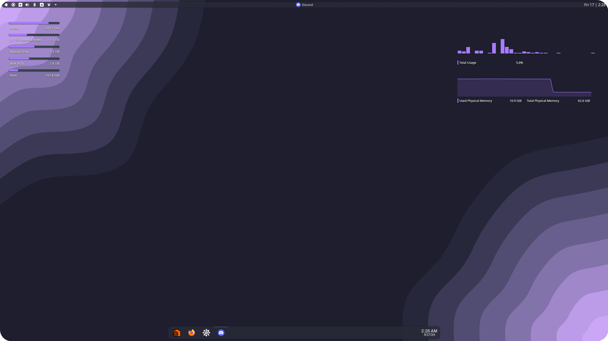
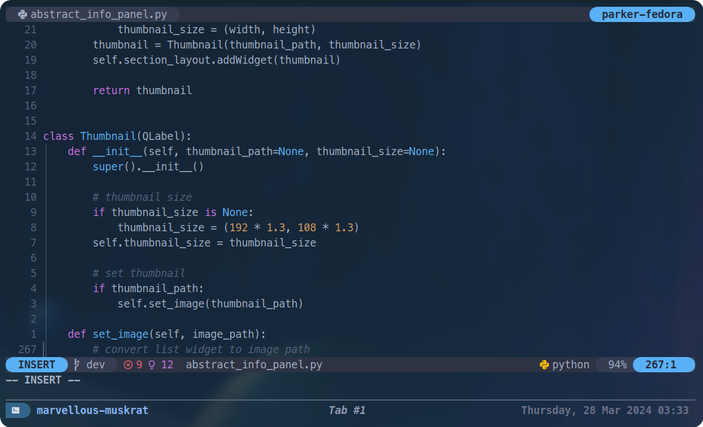
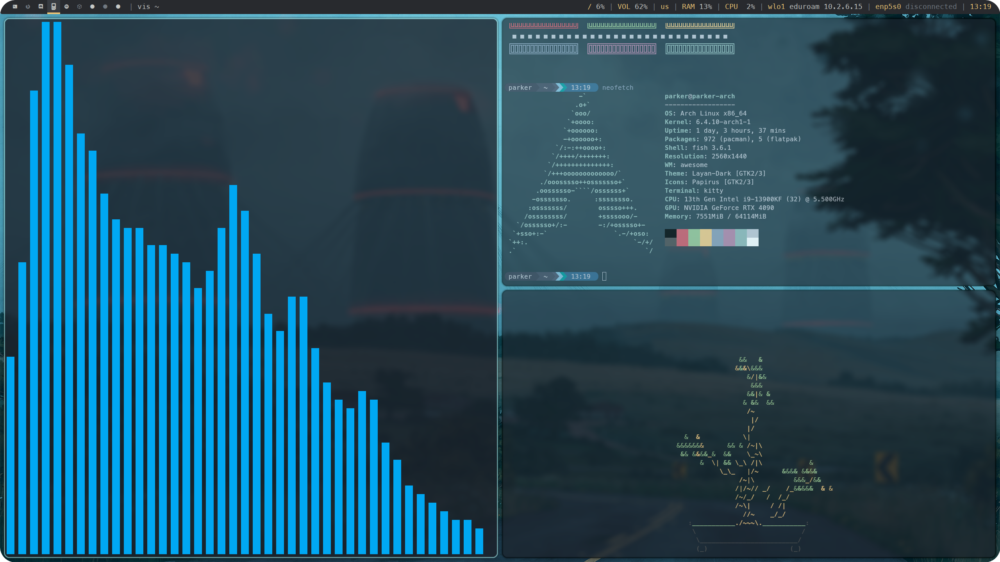

<h1 align="center">Dotfiles</h1>
<!-- 

 

 -->

Personal dotfiles I use on Linux.
I've experimented with my environment for various reasons so it might be a bit all over the place.

</a>

/raw.githubusercontent.com/ParkerBritt/dotfiles/main/screenshots/hyprland.png)

 </a>

 </a>

### Awesome WM

