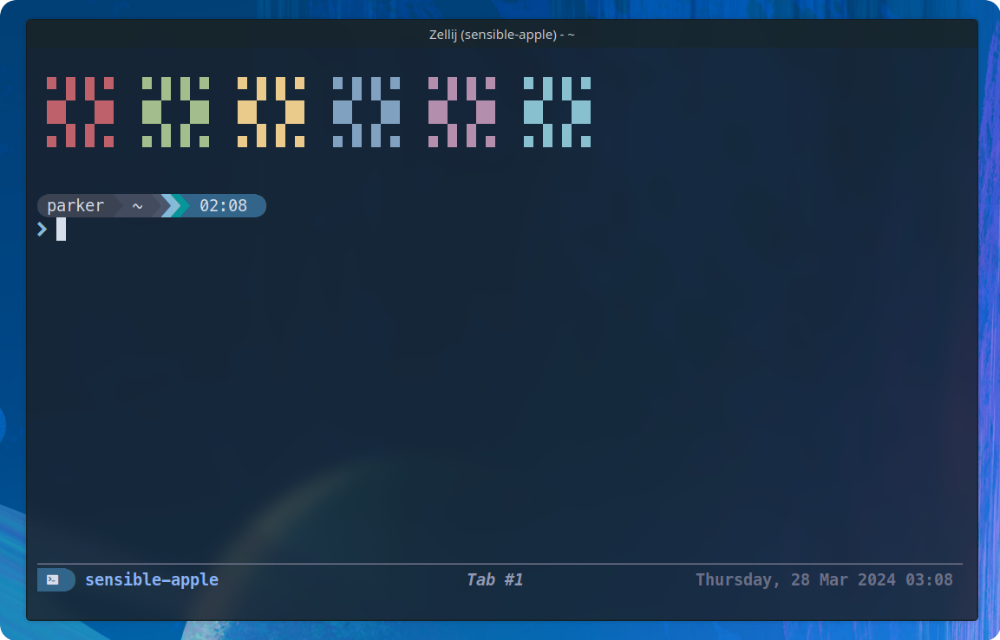
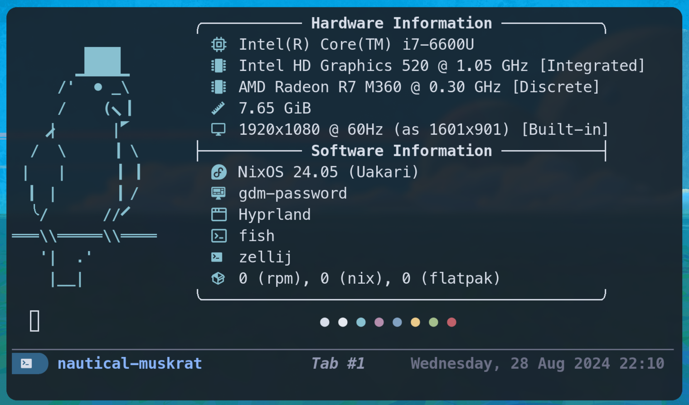

<h1 align="center">Dotfiles</h1>

  
  
  
  
  

Personal dotfiles I use on Linux.
I've experimented with my environment for various reasons so it might be a bit all over the place.

### Terminal

### Fetch

### Neovim

### Hyprland

### KDE

